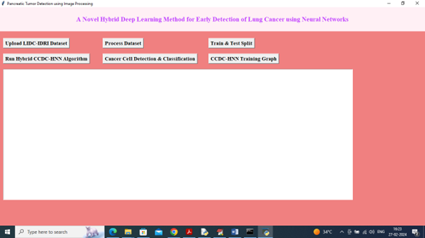
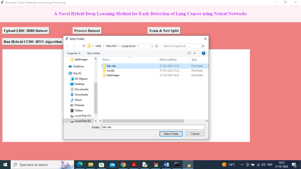
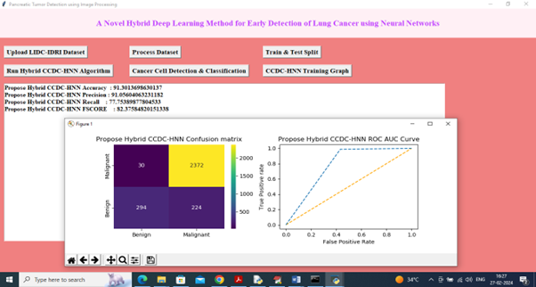

# Lung Cancer Detection System

## Project Description
A deep learning–based application for detecting lung cancer from CT scan images using a Convolutional Neural Network (CNN). The system preprocesses medical images and predicts cancer presence through a simple user interface.
## Tech Stack
- Python
- TensorFlow / Keras
- OpenCV
- NumPy
- Deep Learning (CNN)
- Medical Image Processing

## Features
- Image preprocessing and augmentation
- CNN-based lung cancer detection
- GUI interface for selecting images
- Result prediction display
- Model trained using medical image dataset

## Project Files
- Main.py – Main program to run the system
- Model.py – CNN model architecture
- Augmentation.py – Image preprocessing
- create.py – Dataset preparation
- cnn_weights1.hdf5 – Trained model weights
- requirements.txt – Required libraries
- run.bat – Run file for project
- result.png – Sample output result
- sample processed image.png – Processed sample
- select_image.png – Image selection screen
- start.png – Application start screen

## How to Run
1. Install Python and required libraries
2. Install packages using:
3. Run the program:
4. Select CT image and view prediction result.

## Sample Outputs
See uploaded result images in repository.

## Output Example

### Application Start

### Image Selection

### Processed Image Example

### Prediction Result

